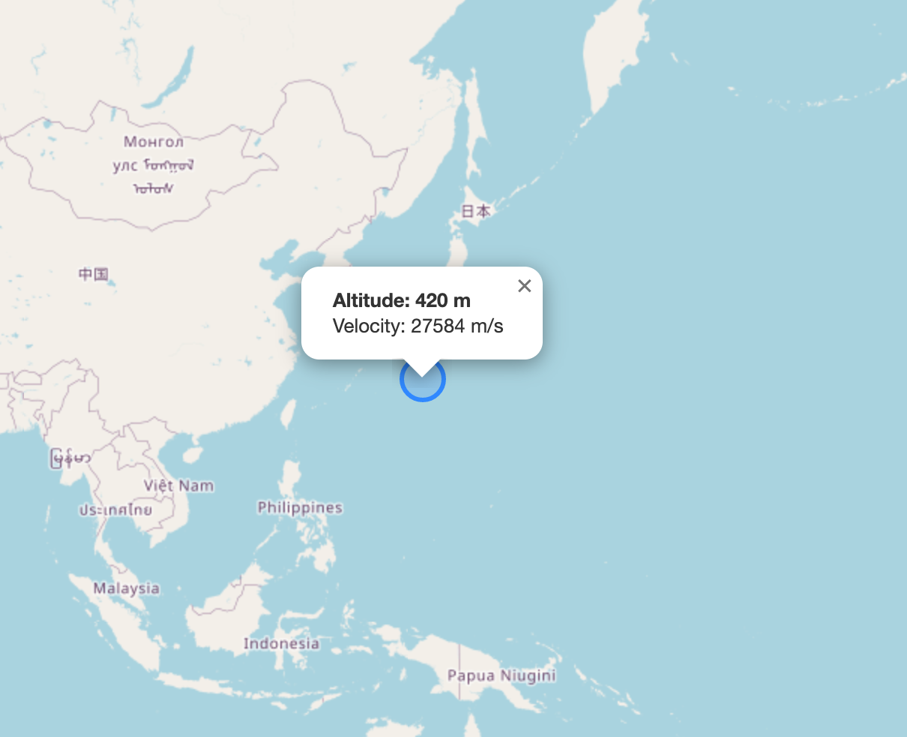
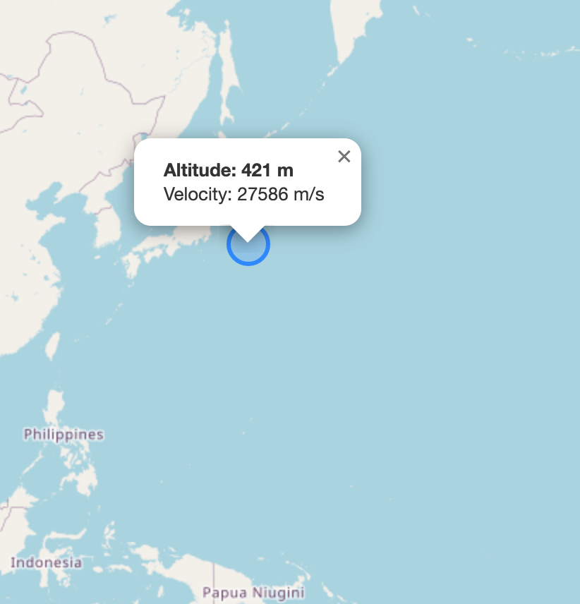

# International-Space-Station
Tracks current location of the International Space Station

## Overview

Using "Where the ISS at?" [API](https://wheretheiss.at/w/developer) and the [Leaflet library](https://leafletjs.com/), this program maps the location of the International Space Station (ISS) on a world map.

## Sample Images

The ISS is represented by a blue marker. When this icon is clicked, a pop-up appears and displays the altitude (in meters) and velocity (in meters per second) of the ISS. Note that it may take a minute or two for the ISS to make a noticeable change in its location. 

Here is the resulting map after reloading the page a minute later. The geographical coordinates, altidue, and velocity have already changed.

